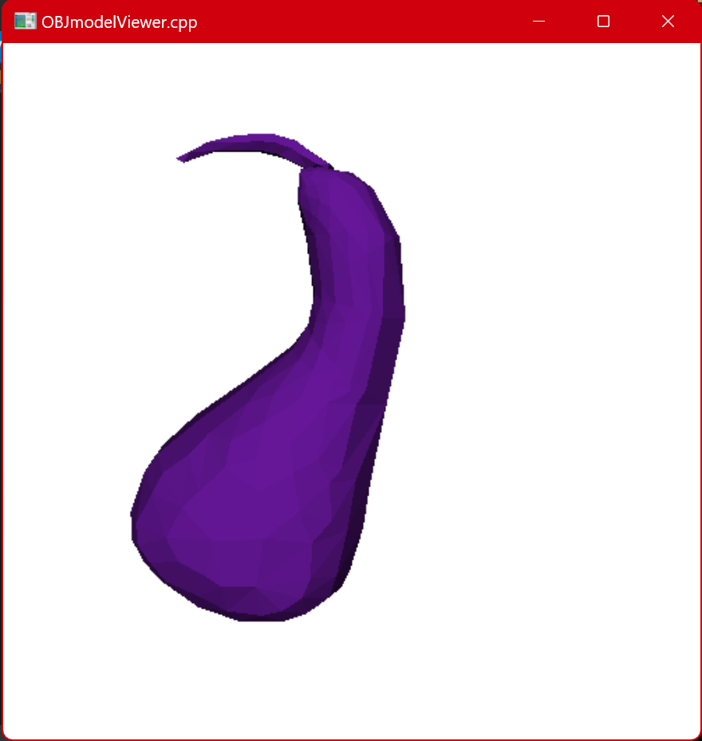
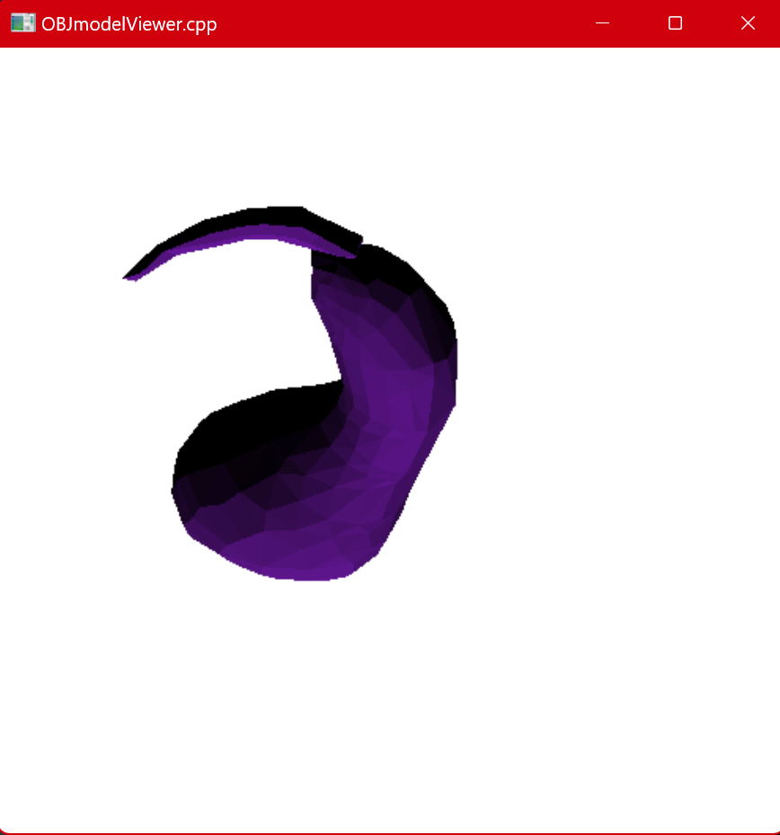
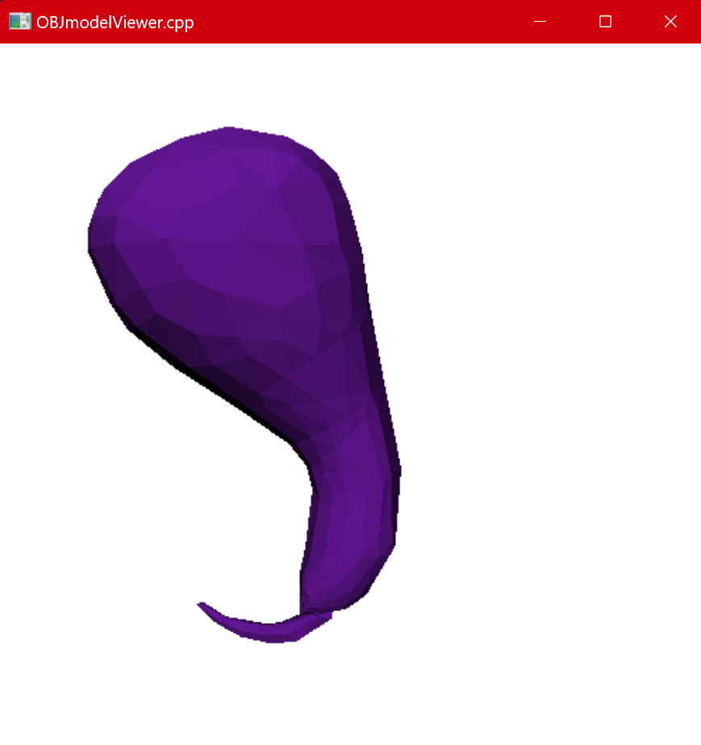

### **上机作业2：手工计算光照效果**

------

#### 1. 设置光线方向

​	 设定光线方向为$(1.0, 2.0, 1.0)$.


#### 2. 计算光线和三角面的法向量的点积：

##### 	 2.1 存储：

​		   创建双精度向量存储光线和三角面的法向量点积.

```c++
	vector<double> dot_products;
```

##### 	 2.2 计算向量叉乘的函数：

​			按照叉乘计算公式计算，并将向量单位化.

```c++
	vector<double> cross_product(vector<double> v1, vector<double> v2) {
		double x = v1[1] * v2[2] - v1[2] * v2[1];
		double y = v1[2] * v2[0] - v1[0] * v2[2];
		double z = v1[0] * v2[1] - v1[1] * v2[0];
		double norm = sqrt(x * x + y * y + z * z);
		return { x / norm, y / norm, z / norm };
    }
```

##### 	  2.3 计算三角面的法向量：

​			 通过三角形的三个点得到两个平面向量，通过向量叉乘得到三角面的法向量.

```c++
	vector<double> face_normal(vector<double> v1, vector<double> v2, vector<double> v3) {
		vector<double> e1 = { v2[0] - v1[0], v2[1] - v1[1], v2[2] - v1[2] };
		vector<double> e2 = { v3[0] - v1[0], v3[1] - v1[1], v3[2] - v1[2] };
		return cross_product(e1, e2);
    }
```

##### 	  2.4 计算光线和法向量的点积

​			 计算光线和法向量的点积并存入$dot\_products$.

```c++
	 double dot_product(vector<double> v1, vector<double> v2) {
		return v1[0] * v2[0] + v1[1] * v2[1] + v1[2] * v2[2];
	 }
```

```c++
	 void calculate_dot_products(float vertices[], int faces[]) {
		for (int i = 0; i < facesVector.size(); i += 3) {
		vector<double> v1 = { vertices[faces[i] * 3], vertices[faces[i] * 3 + 1], vertices[faces[i] * 3 + 2] };
		vector<double> v2 = { vertices[faces[i + 1] * 3], vertices[faces[i + 1] * 3 + 1], vertices[faces[i + 1] * 3 + 2] };
		vector<double> v3 = { vertices[faces[i + 2] * 3], vertices[faces[i + 2] * 3 + 1], vertices[faces[i + 2] * 3 + 2] };
		vector<double> normal = face_normal(v1, v2, v3);
		double dot = dot_product(normal, { 1.0, 2.0, 1.0 });  
		dot_products.push_back(dot);	
		}
	}
```


#### 3. 深度测试

​	   开启深度测试：

```c++
	glEnable(GL_DEPTH_TEST);
```


#### 4. 网格着色

   		设置绘制模式为填充模式.

```c++
    double cl[3] = { 0.4f, 0.09f, 0.6f }; //设置为茄子色
	for (int i = 0; i < facesVector.size(); i += 3) {
	   glPolygonMode(GL_FRONT_AND_BACK, GL_FILL);
	   glBegin(GL_TRIANGLES);
	   double t = dot_products[i / 3];
	   glColor3f(cl[0] * t, cl[1] * t, cl[2] * t); 
	   glVertex3f(vertices[(faces[i]) * 3], vertices[(faces[i]) * 3 + 1], vertices[(faces[i]) * 3 + 2]);
	   glVertex3f(vertices[(faces[i+1]) * 3], vertices[(faces[i+1]) * 3 + 1], vertices[(faces[i+1]) * 3 + 2]);
	   glVertex3f(vertices[(faces[i+2]) * 3], vertices[(faces[i+2]) * 3 + 1], vertices[(faces[i+2]) * 3 + 2]);
	   glEnd();
   }
```


#### **5.旋转后重新计算绘图**

​		获取旋转矩阵：

```c++
	glPushMatrix();
	glRotatef(Zangle, 0.0, 0.0, 1.0);
	glRotatef(Yangle, 0.0, 1.0, 0.0);
	glRotatef(Xangle, 1.0, 0.0, 0.0);
	glGetFloatv(GL_MODELVIEW_MATRIX, rotation_matrix);
	glPopMatrix();
```

​		旋转面法向量，并重新计算其与光向量的点乘：

```c++
	dot_products.clear();

	for (int i = 0; i < face_normal_vector.size(); ++i) {
		vector<double> normal = face_normal_vector[i];
		vector<double>temp(normal);

		temp[0] = rotation_matrix[0] * normal[0] + rotation_matrix[1] * normal[1] + rotation_matrix[2] * normal[2] ;//+ rotation_matrix[3] * 0;
		temp[1] = rotation_matrix[4] * normal[0] + rotation_matrix[5] * normal[1] + rotation_matrix[6] * normal[2];//+ rotation_matrix[7] * 0;
		temp[2] = rotation_matrix[8] * normal[0] + rotation_matrix[9] * normal[1] + rotation_matrix[10] * normal[2];// + rotation_matrix[11] * 0;
		//temp[3] = 0;
		normal = temp;

		double dot = dot_product(normal, light_vector);
		if (dot < 0) dot = 0;
		dot_products.push_back(dot);
	}
```


#### 5. 运行结果





